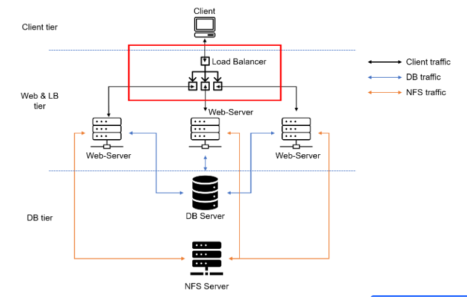
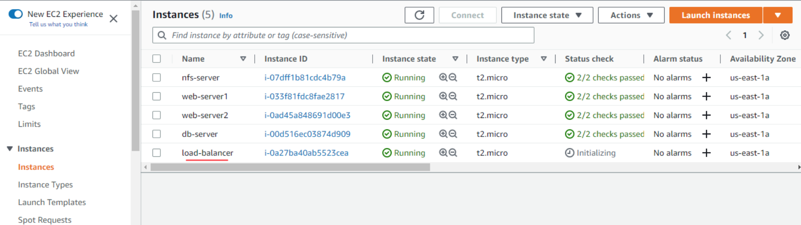
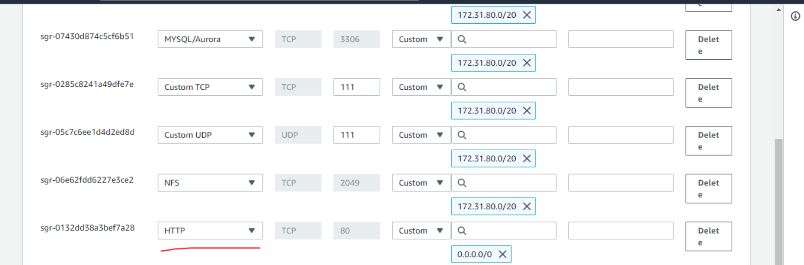

# LOAD BALANCING SOLUTION WITH APACHE

**Load balancing** is the method of distributing network traffic equally across a pool of resources that support an application. Modern applications process millions of users simultaneously and return the correct information to each user in a fast and reliable manner. To handle such high volumes of traffic, most applications have many resource servers with duplicate data between them. A **load balancer** is a device that *sits between the user and the server group and acts as an invisible facilitator, ensuring that all resource servers are used equally*.

In [Project-7](https://github.com/Olaminiyi/DEVOPS-TOOLING-WEBSITE-SOLUTION), we have **three different IP addresses** for the various servers. In ideal scenarios, we will have so many web servers serving the same information from the NFS server. To make this easier for the users, we will introduce a load balancer so that we can access all the information from one IP address.

When we access a website on the Internet, we use URL and we do not really know how many servers are out there serving our requests. This complexity is hidden from a regular user, but in the case of websites that are visited by millions of users per day (like Google, Facebook, Amazon, etc.), it is impossible to serve all the users from a single Web server. It is also applicable to databases.

Each URL contains a domain name part, which is translated (resolved) to the IP address of a target server that will serve requests when opening a website on the Internet. The translation (resolution) of domain names is performed by DNS servers.
In order to hide all this complexity and have a single point of access with a single public IP address or name, a load balancer can be used. A **load balancer (LB)** distributes clients’ requests among underlying web servers and makes sure that the load is distributed in an optimal way.


For more information on load balancing, [click here](https://aws.amazon.com/what-is/load-balancing/).
We will be updating the solution architecture with a load balancer added on top of web servers. We will be using a software application load balancer, e.g., **Apache, NGINX, or HAProxy**.

When you have just one Web server and load increases—you want to serve more and more customers, you can add more CPU and RAM or completely replace the server with a more powerful one—this is called **"vertical scaling.**" This approach has limitations; at some point, you reach the maximum capacity of `CPU` and `RAM` that can be installed on your server.

Another approach used to cater for increased traffic is **"horizontal scaling**," which involves distributing load across multiple Web servers. This approach is much more common and can be applied almost seamlessly and almost infinitely (you can imagine how many servers Google has to serve billions of search requests).

**Horizontal scaling** allows you to adapt to the current load by adding (scale out) or removing (scale in) Web servers. Adjustment of the number of servers can be done manually or automatically.

The property of a system (in our case, the web tier) being able to handle a growing load by adding resources is called **"scalability"**.

### 3-TIER WEB APPLICATION ARCHITECTURE WITH A SINGLE DATABASE, AN NFS SERVER AS A SHARED FILE STORAGE AND A LOAD BALANCER



In this project, we will enhance [Project 7](https://github.com/Olaminiyi/DEVOPS-TOOLING-WEBSITE-SOLUTION) by adding a load balancer to distribute traffic between web servers and allow users to access our website using a single URL.


From project 7, we should make sure of the following:

- Apache process is up and running on the webservers.
- "/var/www" of the webservers are mounted on "/mnt/apps".
- All necessary TCP/UDP ports are open on the webservers, database server and NFS server.
- client server can access both webservers by thier respective IP addresses and can access the database i.e login successfully.

Sometimes it is tedious to remember and switch between IP addresses, especially if you have a lot of servers under your management. What we can do, is to configure local domain name resolution. The easiest way is to use /etc/hosts file, although this approach is not very scalable, but it is very easy to configure and shows the concept well. So let us configure IP address to domain name mapping for our LB.

I will give my webservers names as `Web01` and `Web02`.

Open "/etc/hosts
```
sudo vi /etc/hosts
```


Create an Ubuntu Server 20.04 EC2 instance



Open `TCP port 80` on laod balancer by creating an Inbound Rule in Security Group.



